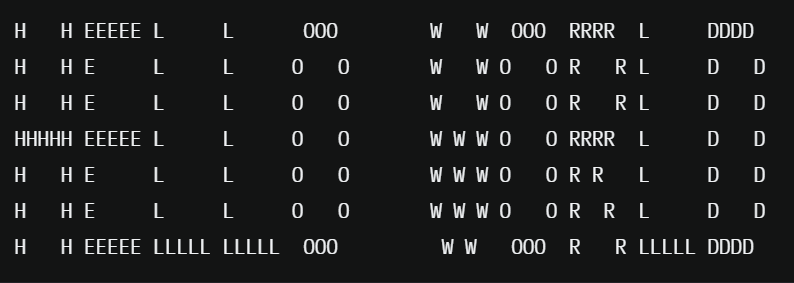
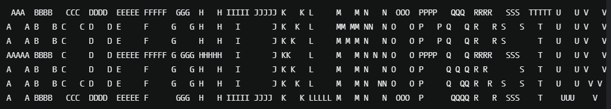
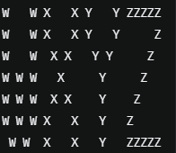

### DESCRIPTION:

Write a function that accepts a string consisting only of ASCII letters and space(s) and returns that string in block letters of 5 characters width and 7 characters height, with one space between characters.

The string should be formatted in a way that when passed to Javas' System.out.println() function shows the desired output (see below for example).

- The block letters should consist of corresponding capital letters.
- It's irrelevant whether input consists of lower or upper case letters.
- Any leading and/or trailing spaces in input should be ignored.
- Empty strings or such containing only spaces should return an empty string.
- The remaining spaces (between letters and/or words) are to be treated as any other character. This means that there will be six spaces in output for a space in input, or a multiple of six, if there were more spaces - plus the one from preceding character!
- Trailing spaces should be removed in the resulting string.

### EXAMPLE:

System.out.println(BlockLetterPrinter.blockPrint("heLLo WorLD"));

should result in an output that looks like this:

As most of the characters can be printed in many different ways (think of Q, F or W), here is what they're expected to look like:

### TAGS:

Strings, ASCII art, algorithms
